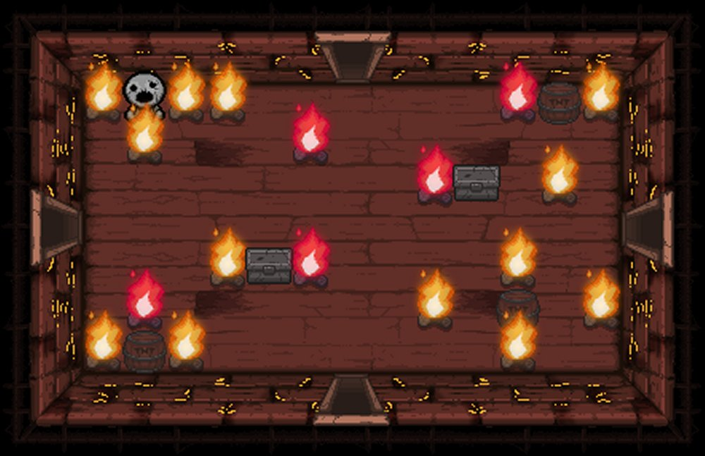

<!DOCTYPE html>
<html lang="en">
	<head>
		<meta charset="utf-8">
		<title>The Binding of Isaac</title>
		<link rel="icon" href="images/favicon.png">
		<link rel="stylesheet" href="styles/stylesheet.css">
	</head>
	<body>
		

    		
		

		<main>
			<section class="level-1-1">			</section>
			<section class="level-2-1">
			</section>
			<section class="level-3-1">
			</section>
			<section class="level-4-1">
			</section>
			<section class="level-1-2">
				
			</section>
			<section class="level-2-2">
			</section>
			<section class="level-3-2">
				
			</section>
			<section class="level-4-2">
			</section>
			<section class="level-1-3">
			</section>
			<section class="level-2-3">
			</section>
			<section class="level-3-3">
			</section>
			<section class="level-4-3">
			</section>
			<section class="level-1-4">
			</section>
			<section class="level-2-4">
			</section>
			<section class="level-3-4">
			</section>
			<section class="level-4-4">
			</section>
		</main>
	</body>
</html>
